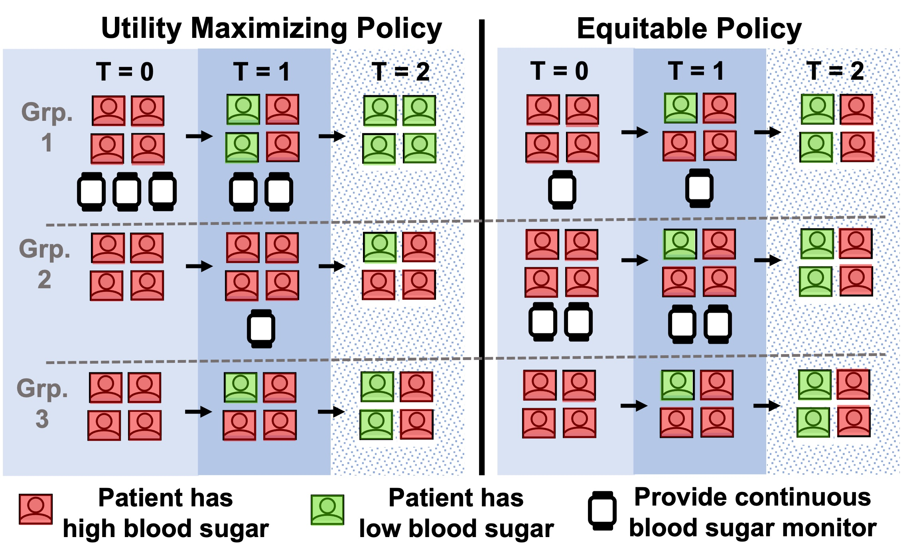

# Repository for Equitable Assignments of Limited Interventions over Groups, with Application to Digital Health
Technical focus: Restless Multi-armed Bandit Planning, Markov Decision Processes, Simulation

Accompanies the paper: Killian JA, Jain M, Jia Y, Amar J, Huang E, Tambe M. Equitable Restless Multi-Armed Bandits: A General Framework Inspired By Digital Health. Arxiv. 2023.

<center>

</center>

## Getting started
* Run `bash make_dirs.sh` to create the directory structure.
* Create a virtual environment with the necessary libraries (see Virtual environment section below).
* Test that everything is set up correctly with `python run_experiments.py --test` (executes an example set of experiments, printing statistics to stdout, then returns to the command line after ~10 seconds)

## Virtual environment
* Tested in a `virtualenv==20.24.3` with `Python 3.10.12`.
* See `requirements.txt` for list of dependencies.
* To create a virtualenv run: `virtualenv equitable_rmab_env`
* To enter the env run: `source equitable_rmab_env/bin/activate`
* To install dependencies, `cd` into the repo home directory, then run `pip install -r requirements.txt`

## Running experiments
**To run the experiments and generate plots from the arxiv paper (with lower n_trials), run**
```
bash run_all_local.sh
```

More generally, to run a subset of experiments the workflow is as follows:
1. Define a simulation model, a set of policies+parameters to run in that simulation and an experiment name, e.g.:
```
expname="counterexample"
model="inputs/model_data/counterexample.csv"
params="inputs/params/counterexample_params.csv"
argsin="--expname ${expname} --model ${model} --params ${params}"
python run_experiments.py $argsin --n_chunks 8 > tmp/run.sh
bash tmp/run.sh  # A quick way to locally run batches of simulations in parallel
```
2. Once experiments complete, combine the results:
```
python combine_results.py $argsin
```
3. The plot the results and save the aggregated results to csv:
```
python analysis.py $argsin --csv
```
* Then view the image outputs in `outputs/img/$expname/` and csv outputs in `outputs/csv_summaries/$expname/`

## Repo structure
* `environments.py` specify the Markov Decision Process models for the arms of the Restless Bandit
* `policies.py` specify the policies for acting within the Restless Bandit evironments.
* `simulator.py` is boilerplate for running simulations of `RMABPolicy` classes within `RMABEnvironment` classes and saving raw results to `data/`.
* `run_experiments.py` is setup code for defining experiments from all combinations of parameters and producing convenience commands for running them in parallel.
* `combine_results.py` aggregates data from parallel runs of experiments once they are complete. Combined results are saved in `data/`.
* `analysis.py` produces various plots describing results of the experiments, saved in `outputs/`
* `*_test.py` are structured scripts with unit tests for the various classes in the repository.
* `inputs/model_data/` contain data to instantiate classes within environments.py
* `inputs/params/` contain parameter lists for running experiments, e.g., number of arms, budget, etc.

### Requirements to create and run your own experiments
#### Model data files
* Kept in `inputs/model_data/`
* Must be in CSV format and a header with column names is required.
* One row per "group", where groups are logical units each containing disjoint lists of arms. The goal is to ensure equitable outcomes between these groups.
* Contains at least 2 columns: 
    * `Group`: unique indexes of groups -- indexes should count up from 0
    * `frac`: defines what percentage of arms will belong to each group.
* Additional columns will define other parts of the model (e.g., probabilities or rewards) specific to the structure of the class in `environments.py` that it instantiates. E.g., `inputs/model_data/marketscan.csv` instantiates the `DiabetesAppEnvironment` and `DiabetesAppPartialObsEnvironment` environments. It contains additional columns that define:
    * Transition probabilities: `p_i_mtoe`, `p_i_mtod`, `p_i_etoe`, `p_u_mtod`, `p_noeng_gl`, `p_noeng_ll`, `p_eng_gl`, `p_eng_ll`
    * Rewards: `r_dropout`, `r_maintenance`, `r_eng`, `r_a1cgt8`, `r_a1clt8`
    * Group definitions: `age`, `sex`
* A model data file parser needs to be written for each new class in environments.py, e.g., `DiabetesAppEnvironment.parse_model_data()` parses model data files for `DiabetesAppEnvironment`. However, if the environment is simple and does not require defining model data outside the class, one can use the default model data parser `RMABEnvironment.parse_default_data()`, which parses only the required `Group` and `frac` columns. E.g., `RandomEnvironment` uses the default parser, since its internal probability and reward data are randomly generated.

#### Experiment parameter files
* Kept in `inputs/params/`
* Defines parameters for an experiment run. Must be in CSV format and a header with any value is required.
* Each row after the header defines one parameter. The first column contains the parameter name. Subsequent columns should have the following structure (by parameter) and must contain these parameter names:
    * `n_arms_list`: a list of integers, defining the number of arms in the RMAB experiment
	* `budget_frac_list`: a list of floats < 1, defining the budget for the RMAB experiment as a fraction of n_arms
	* `policy_list`: A list of strings of policy names. Each entry must match the return value of the `policy_key()` function of one of the classes in `policies.py`
	* `horizon_list`: A list of integers, defining the length of the planning and simulation horizon
	* `n_trials`: A single integer defining how many trials of each combination of parameters to run
	* `environment_name`: A single string, defining the RMAB environment. Must match the return value of the `env_key()` function of one of the classes in `environments.py`
    * `base_seed`: A single integer defining the base random seed.
    * `stream_map`: A list of floats defining what percentage of arms should start at each time point in the simulation (if streaming is implemented in the corresponding `environment_name`). The first entry corresponds to arms starting at time 0, the second entry corresponds to arms starting at time 1, and so on. The list should not be longer than the smallest entry in `horizon_list` and must sum to 1.
* Additional parameters may be required by each environment. See the environment's `environment_params()` function for additional parameters and their types. E.g., 
	* `DiabetesAppEnvironment` and `DiabetesAppPartialObsEnvironment` environments require `alpha`, a float. So alpha must be included in the experiment parameter file as a list of floats (see `inputs/params/fullobs_params.csv`)
	* `RandomEnvironment` requires `n_states`, an int. So `n_states` must be included in the experiment parameter file as a list of ints (see `inputs/params/random_params.csv`)
* Beyond this, additional rows and parameters will be ignored.

## Implementing a new environment.
* New environments should be added as a class to `environments.py`.
* The class must inherit the abstract base class `RMABEnvironment`, and override at least the methods marked as `@abc.abstractmethod`.
* See `RandomEnvironment` for a minimal complete example.
* Ensure that all the overridden methods implement at least the functionality already given in the base methods. E.g., `get_info(self) -> dict[str, object]` should return a dict containing at least
```
{
  'group_map': self.group_map,
  'active_arms_helper': self.create_active_arms_helper(),
}
```
* Once the environment class is implemented, add the class name to `environments.Config.class_list`.
* If your environment does not implement streaming, stop here.
* Else, if your environment implements streaming, you must also implement a helper class in `util.py`
	* The helper class must inherit the abstract base class `GetActiveArms`
    * The helper class must override `GetActiveArms.get_active_arms(self, states: np.ndarray = None) -> np.ndarray` which takes a set of states for a specific environment and returns a one-hot vector of the arms that correspond to active states. This will likely require only a simple dictionary mapping follwed by accessing a specific entry of a state tuple, or similar.
	* Once this class is implemented, override the `RMABEnvironment.create_active_arms_helper(self) -> util.GetActiveArms` method for your new environment with a method that 1) instantiates your new helper class 2) assigns it to `self.active_arms_helper` in your new environment class, and 3) returns the instaniated helper class.
	* That this helper class exists is a little non-intuitive... but there is a reason! We need to be able to define get_active_arms functions specific to environment instances. We also need policy classes to be able to call get_active_arms. Finally, we need to save policy class instances without saving the environment class instances, since envs can be very large. If we did the natural thing, and defined get_active_arms within the environment class, then coupled the policy class to that function, we would end up in this undesirable situation of saving the environment instance. So this helper class is the go-between.
	

## Implementing a new policy
* New policies should be added as a class to `policies.py`.
* The class must inherit the abstract base class `RMABPolicy`, and override its `@abc.abstractmethods`.
* See `RandomPolicy` for a minimal complete example.
* Once the environment class is implemented, add the class name to `policies.Config.class_list`.


## Running Tests
* To run test cases over the environment classes, run: `python environments_test.py`
* To run test cases over the policy classes, run: `python policies_test.py`
